<!--
Repository page strategy:
- Use self-contained SVGs for the visual system.
- Keep the README readable, keyword-rich, and practical for SEO.
-->

<p align="center">
  
</p>

<p align="center">
  
</p>

<p align="center">
  <a href="#quick-start">Quick start</a> ·
  <a href="#what-you-get">What you get</a> ·
  <a href="#template-files">Template files</a> ·
  <a href="#seo-notes">SEO notes</a>
</p>

# Profile Signal Kit

**Profile Signal Kit** is an **animated GitHub Profile README template** and **SVG asset system** for people who want a beautiful GitHub profile README without relying on custom CSS, fragile Markdown tables, or local previews that GitHub cannot reproduce.

It helps you build an **aesthetic GitHub profile**, **cool GitHub profile README**, **developer portfolio README**, or **profile README starter** with:

- animated SVG hero banners
- section dividers
- project cards
- current focus panels
- working style panels
- image frames
- starter templates
- repository SEO guidance

This starter is built for GitHub's actual README renderer. It is designed to look good in **GitHub light mode** and **GitHub dark mode** by keeping the core design inside self-contained SVG files.

The core idea is simple: GitHub controls the page around your README, so this kit puts the visual system inside local SVG assets: hero banners, project cards, dividers, focus panels, working style panels, and a stable SVG README banner.

<p align="center">
  
</p>

## What you get

<p align="center">
  
</p>

<p align="center">
  
  
</p>

<p align="center">
  
  
</p>

<p align="center">
  
</p>

<p align="center">
  
</p>

<p align="center">
  
</p>

## Quick start

<p align="center">
  
</p>

1. Create or open your special GitHub profile repository:
   `your-username/your-username`

2. Copy these files into it:
   - `templates/PROFILE-README-TEMPLATE.md` → rename to `README.md`
   - any assets from `assets/` that you want to use

3. Replace:
   - name
   - username
   - project links
   - descriptions
   - focus statements
   - working style lines

4. Commit and push.

5. Visit your GitHub profile and adjust the copy until the profile feels like **identity → work → focus → style → signals**.

## Template files

- `templates/PROFILE-README-TEMPLATE.md`
- `templates/REPOSITORY-README-TEMPLATE.md`
- `docs/SEO-CHECKLIST.md`
- `docs/REPOSITORY-METADATA.md`

## Recommended profile structure

```text
Hero
Badges / typing line
Divider
Selected work cards
Current focus panel
Working style panel
Profile signals / stats
Tiny footer signal
```

## Customization tips

<p align="center">
  
</p>

- Use the **portrait frame** only if it strengthens your identity.
- Keep playful GIFs small and near the bottom.
- Put the best repositories before personality blocks.
- Avoid large Markdown tables for visual layout.
- Use the SVG panels to preserve a stable look in GitHub light mode.
- Keep motion subtle: scan, pulse, dashed routes, soft glows.

## SEO notes

A GitHub repository is not a full marketing website, but you can still improve discoverability.

Use this repository metadata:

**Repository name suggestion**
- `profile-signal-kit`
- `animated-github-profile-readme-template`
- `github-profile-readme-svg-template`

**Repository description**
- `Animated GitHub Profile README template with dark SVG banners, cards, dividers, and starter files.`

**Suggested topics**
- `github-profile-readme`
- `github-profile-template`
- `readme-template`
- `animated-svg`
- `svg-banner`
- `developer-portfolio`
- `github-readme`
- `profile-readme`
- `profile-design`
- `personal-branding`
- `open-source-design`

The README also naturally includes the phrases people are likely to search:
- GitHub profile README template
- animated GitHub profile
- beautiful GitHub profile README
- aesthetic GitHub profile
- cool GitHub profile README
- SVG README banner
- GitHub profile design
- developer portfolio README
- profile README starter

## License

MIT. Use it, remix it, and adapt it.

<p align="center">
  
</p>
